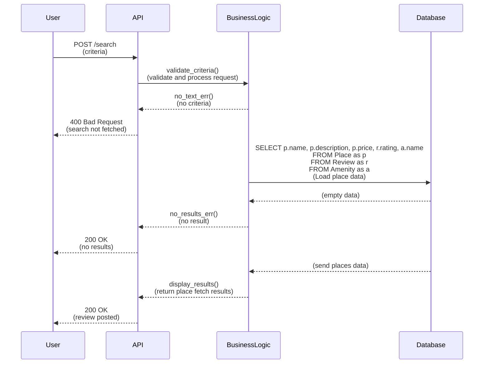

# Fetching a List of Places UML Sequence Diagram
What happens when a user equests a list of places based on certain criteria?

```mermaid
sequenceDiagram

User->>API: POST /search<br>(criteria)
API->>BusinessLogic: validate_criteria()<br>(validate and process request)
BusinessLogic-->>API: no_text_err()<br>(no criteria)
API-->>User: 400 Bad Request<br>(search not fetched)

BusinessLogic->>Database: SELECT p.name, p.description, p.price, r.rating, a.name<br>FROM Place as p<br>FROM Review as r<br>FROM Amenity as a<br>(Load place data)
Database-->>BusinessLogic: (empty data)
BusinessLogic-->>API: no_results_err()<br>(no result)
API-->>User: 200 OK<br>(no results)

Database-->>BusinessLogic: (send places data)
BusinessLogic-->>API: display_results()<br>(return place fetch results)
API-->>User: 200 OK<br>(review posted)
```
